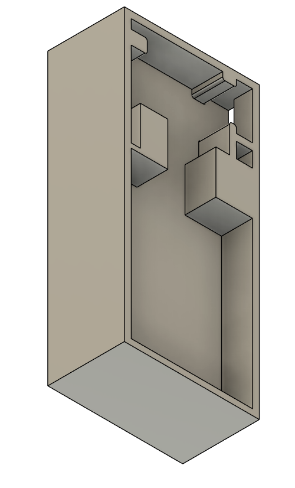
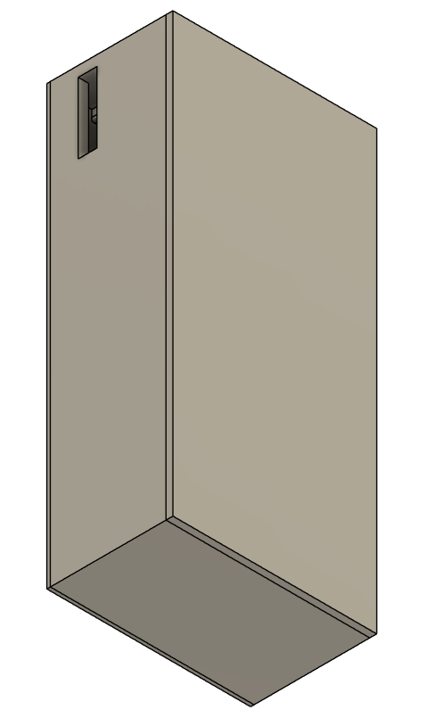

Navigation: [Home](/Process-Journal-Task-2/) · [Week 6](/Process-Journal-Task-2/weeks/week6.html) · [Week 7](/Process-Journal-Task-2/weeks/week7.html) · [Week 8](/Process-Journal-Task-2/weeks/week8.html) · [Week 9](/Process-Journal-Task-2/weeks/week9.html) · [Week 10](/Process-Journal-Task-2/weeks/week10.html) · [Week 11](/Process-Journal-Task-2/weeks/week11.html)

# Week 10 — Hardware pivot + clearer thresholds

This week I kicked off Task 3 by moving to an ESP32 board with built-in BLE, adding a CO₂ + temperature sensor, and keeping the glanceable LED mirror for the UI states.

---

### Goals
- Switch to SparkFun Thing Plus – ESP32 WROOM (USB-C) for simpler power + native BLE.
- Add PiicoDev ENS160 (eCO₂/TVOC) + TMP117 (temperature) to test a self-contained rule.
- Keep the 3-state pattern and refine conservative thresholds.

---

### Changes from last week
- Board: moved from RP2040 to ESP32 (built-in BLE; 3.3 V sensor power).  
- Sensors: PiicoDev **ENS160** + **TMP117** via I²C (QT/STEMMA).  
- Enclosure: printed rectangular PLA case (Bambu P1S), lower chest mount (across chest) for comfort + LED visibility.

<figure>
  
  <figcaption>Printed PLA housing with filleted edges mounted low on the chest strap. LED window is visible at ~1–2 m.</figcaption>
</figure>

<figure>
  
  <figcaption>Inside view: SparkFun Thing Plus ESP32, diffused RGB LED (R/G/B on GPIO 13/12/14 via 330 Ω), ENS160/TMP117 on I²C (3V3, GND, SDA 21, SCL 22).</figcaption>
</figure>

---

### Risk rule v2 (draft, now includes CO₂)
Inputs: CO₂ (ppm, from ENS160 eCO₂), Temperature (°C).  
Decision: choose the **worst** of the two signals.

```pseudo
state = "Good to run"

if co2_ppm >= 1200 or temp_c >= 32:
    state = "Slow + water break"
elif co2_ppm >= 800 or temp_c >= 28:
    state = "Shorten route"
# else: Good to run

Optional dog factor: when near a boundary, a small multiplier (e.g., ×1.05 for heavy coat/age) can bump the state up one level.

Copy v2 (short + glanceable)

Chip labels (≤3 words): Good to run · Shorten route · Slow + water

Banner (one line each):

Good — Conditions safe. Keep an easy pace.

Caution — Heat/air rising. Pick a shorter loop; plan water.

Alert — High heat/air. Slow down, shade, give water.

Rationale: verb-first, no hedging; colour + label paired; details live in the expanded banner if needed.

Physical feedback (plan)

Using a single diffused RGB LED as a mirror of the UI chip: green = Good, amber = Caution, red = Alert. It sits behind a small window in the pouch and is visible at a glance.

<div class="img-row"> <figure>  <figcaption>LED mirror of UI state in the pouch window.</figcaption> </figure> <figure>  <figcaption>Alternative: brief haptic on <em>Alert</em> (deferred).</figcaption> </figure> </div> <style> .img-row{display:flex;gap:12px;flex-wrap:wrap;margin:8px 0} .img-row figure{flex:1 1 360px;margin:0} .img-row img{width:100%;height:auto;border-radius:8px} .img-row figcaption{font-size:.9rem;color:#4b5563;margin-top:6px} </style>
Testing plan (this week)

Scenarios: cool morning vs warm afternoon; breezy vs still.

Method: 10–15 min walks/jogs; note readability and action clarity.

Data: record CO₂ (ppm) + Temp (°C) → state transitions.

Evidence (images)
<figure>  <figcaption>Annotated parts flat-lay used for wiring plan and BOM cross-check.</figcaption> </figure> <figure>  <figcaption>Housing internals: standoffs for ESP32, rounded interior edges, and a small window for the slide switch/light pipe.</figcaption> </figure> <figure>  <figcaption>Detail of internal features: standoffs, cable relief, and switch pocket to avoid board stress.</figcaption> </figure> <figure>  <figcaption>Closed-lid view confirming tolerances and slot alignment for the switch.</figcaption> </figure>
What I learned / changes to make

Readability in motion is good; copy v2 is faster to parse.

These CO₂/Temp boundaries feel right for exertion; will watch near-boundary cases.

Physical feedback helps when the phone isn’t visible; LED is simpler than haptic for v1.

Next (Week 11)

Lock thresholds and publish rule v2.

Build the tiny expanded banner (Why + one Action).

If time: LED shots with quick swappable colours (no flashing).