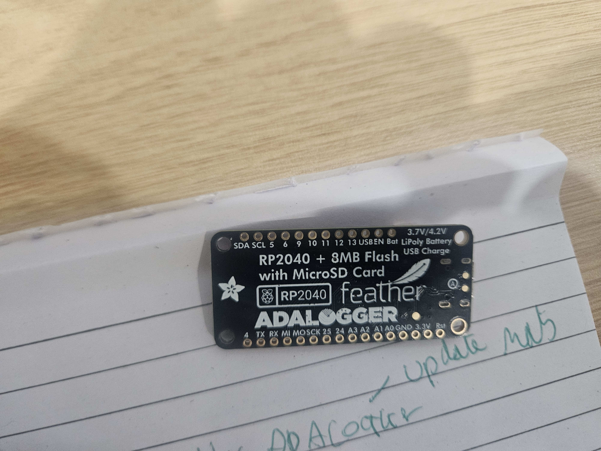
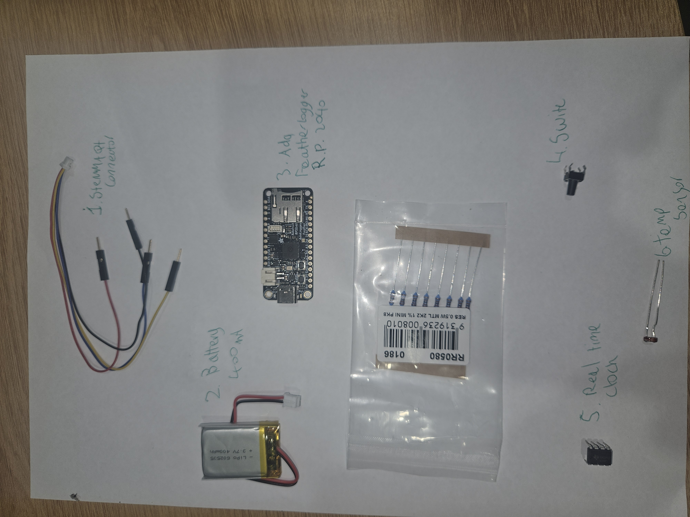

**Navigation:** [Home](/Process-Journal-Task-2/) · [Week 6](/Process-Journal-Task-2/weeks/week6.html) · [Week 7](/Process-Journal-Task-2/weeks/week7.html) · [Week 8](/Process-Journal-Task-2/weeks/week8.html) · [Week 9](/Process-Journal-Task-2/weeks/week9.html) · [Week 10](/Process-Journal-Task-2/weeks/week10.html) · [Week 11](/Process-Journal-Task-2/weeks/week11.html)

# Week 10 — Task 3 kickoff

This week I moved from the Week 9 presentation into concrete planning for the working prototype. I locked v1 scope, clarified constraints, and set a simple three-state rule so I can build and test quickly next.

---

## Scope (v1)
- Glanceable **UI** on phone (chip + expandable banner) with **one action** per state.
- A **physical mirror** of the state (LED) so I don’t need to look at the screen.
- **Local sensing** (preferred) with a clear fallback message when using nearest-station data.

---

## Constraints & choices
- **Comfort & safety:** small, rounded enclosure mounted **lower on the chest**; no sharp edges; no on-body charging.
- **Battery & simplicity:** solid LED colours only (no flashing); minimal animations; short sessions while testing.
- **Privacy:** no IDs or trails; only ephemeral state.
- **Clarity:** copy stays terse; colour is always paired with a label.

---

## Initial rule (shape)
Choose the **worst** of the heat/air signals (kept generic this week; exact numbers locked later).

```pseudo
state = "Good to run"

if air_or_heat_is_high:
    state = "Slow + water break"
elif air_or_heat_is_moderate:
    state = "Shorten route"
# else: Good to run```

CCopy (v1)

Chip: Good to run · Shorten route · Slow + water

Banner (one line each):

Good — Conditions safe. Keep an easy pace.

Caution — Heat/air rising. Pick a shorter loop; plan water.

Alert — High heat/air. Slow down, shade, give water.

Prototype references (from existing UI)
<figure>  <figcaption>Chip → Banner pattern kept terse: one Why, one Action.</figcaption> </figure> <figure>  <figcaption>Alert wording tightened for clarity in motion.</figcaption> </figure>
Evidence (Week 10 photos)
<figure>  <figcaption>RP2040 Feather Adalogger I first planned to use in Task 3 before pivoting to ESP32.</figcaption> </figure> <figure>  <figcaption>Early parts flat-lay for the first build idea (RP2040 + LiPo + switch + RTC + temp). Useful for wiring plan and BOM cross-check.</figcaption> </figure> <figure>  <figcaption>Tiny diffuser bead I tried as a light pipe for a glanceable LED—concept carried forward.</figcaption> </figure> <figure>  <figcaption>Quick breadboard LED test to validate the “solid colour only” approach for glanceable feedback.</figcaption> </figure>
What I’ll do next (Week 11)

Commit to hardware (ESP32) and 3D-print the soft-edged housing.

Wire sensors and mirror states to a diffused RGB LED.

Lock conservative thresholds and run two short checks (cool morning vs warm arvo).