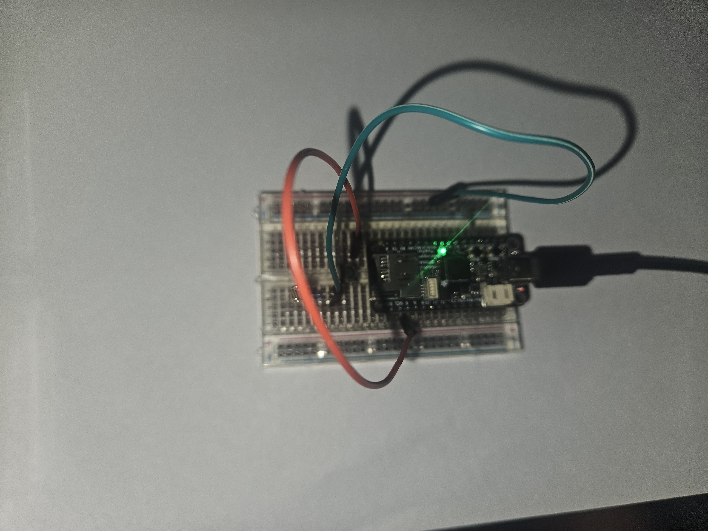

**Navigation:** [Home](/Process-Journal-Task-2/) · [Week 6](/Process-Journal-Task-2/weeks/week6.html) · [Week 7](/Process-Journal-Task-2/weeks/week7.html) · [Week 8](/Process-Journal-Task-2/weeks/week8.html) · [Week 9](/Process-Journal-Task-2/weeks/week9.html) · [Week 10](/Process-Journal-Task-2/weeks/week10.html) · [Week 11](/Process-Journal-Task-2/weeks/week11.html)

# Week 10 — Task 3 kickoff

This week I moved from the Week 9 presentation into concrete planning for the working prototype. I locked v1 scope, clarified constraints and set a simple three-state rule so I can build and test quickly next.

## First hardware plan (RP2040) and LED test

This week I laid out the initial hardware direction using an Adafruit Feather RP2040 Adalogger, a LiPo pack, a small slide switch and a single diffused LED as a glanceable status mirror. I breadboarded a minimal test to confirm visibility and the “no flashing, solid colour” rule.

## What I set out to do
- Prove the LED mirror concept (Good/Amber/Red) without building full sensing.
- List a simple, purchasable set of parts for a first build.
- Check how the LED reads at ~1–2 m while walking.

## Materials chosen (and why)
- **Microcontroller:** *Feather RP2040 Adalogger* — I had it on hand; easy USB power; on-board storage for future logs.  
- **Power:** *3.7 V LiPo 400 mAh* — light, common Feather JST.  
- **Switch:** small slide switch — safe, positive on/off.  
- **Indicator:** 5 mm diffused RGB LED + resistors — bright but not harsh; solid colours only.

<figure>
  
  <figcaption>RP2040 Adalogger used for the first LED mirror test.</figcaption>
</figure>

<figure>
  
  <figcaption>Starter kit for the LED proof: board, battery, resistors, slide switch, LED.</figcaption>
</figure>

## First LED test (breadboard)
I wired the LED (common cathode) with series resistors and cycled colours to check readability and glare.

<figure>
  
  <figcaption>Diffused LED bead — chosen for a soft, readable glow.</figcaption>
</figure>

<figure>
  
  <figcaption>Breadboard test: solid colours only (no flashing) look best while moving.</figcaption>
</figure>

## What worked
- The single LED is readable at ~1–2 m and doesn’t demand attention like a screen.
- The feather form factor is compact; battery and switch integrate cleanly.

## What was missing 
- **No built-in BLE** → would need an extra module just to talk to the phone.  
- Air/heat sensing via loose parts would add wiring bulk and more power rails.  
- Library support for the sensors I wanted was cleaner on ESP32.

**Decision:** keep the single-LED concept, but pivot the MCU to ESP32 (built-in BLE + 3.3 V I²C)** and use compact PiicoDev I²C sensors to cut wiring and speed development. That pivot is Week 11.

---

## Scope (v1)
- Glanceable **UI** on phone (chip + expandable banner) with **one action** per state.
- A **physical mirror** of the state (LED) so I don’t need to look at the screen.
- **Local sensing** (preferred) with a clear fallback message when using nearest-station data.

---

## Constraints & choices
- **Comfort & safety:** small, rounded enclosure mounted **lower on the chest**; no sharp edges; no on-body charging.
- **Battery & simplicity:** solid LED colours only (no flashing); minimal animations; short sessions while testing.
- **Privacy:** no IDs or trails; only ephemeral state.
- **Clarity:** copy stays terse; colour is always paired with a label.

---

## Initial rule (shape)
Choose the worst of the heat/air signals (kept generic this week; exact numbers locked later).

```pseudo
state = "Good to run"

if air_or_heat_is_high:
    state = "Slow + water break"
elif air_or_heat_is_moderate:
    state = "Shorten route"
# else: Good to run```

CCopy (v1)

Chip: Good to run · Shorten route · Slow + water

Banner (one line each):

Good — Conditions safe. Keep an easy pace.

Caution — Heat/air rising. Pick a shorter loop; plan water.

Alert — High heat/air. Slow down, shade, give water.

Commit to hardware (ESP32) and 3D-print the soft-edged housing.

Wire sensors and mirror states to a diffused RGB LED.

Lock conservative thresholds and run two short checks (cool morning vs warm arvo).

Evidence to add later (when available)

Short clip: LED readability at ~1–2 m while walking (evening + daytime).

Weight check of the RP2040 breadboard pack.

Any glare comparison (diffused vs clear LED).