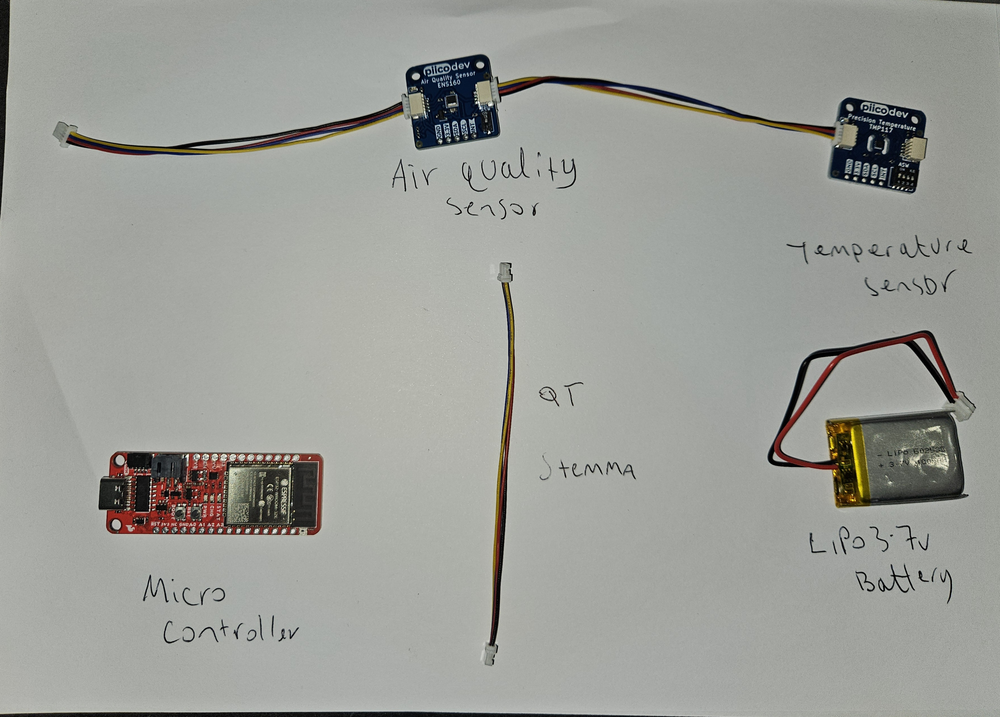
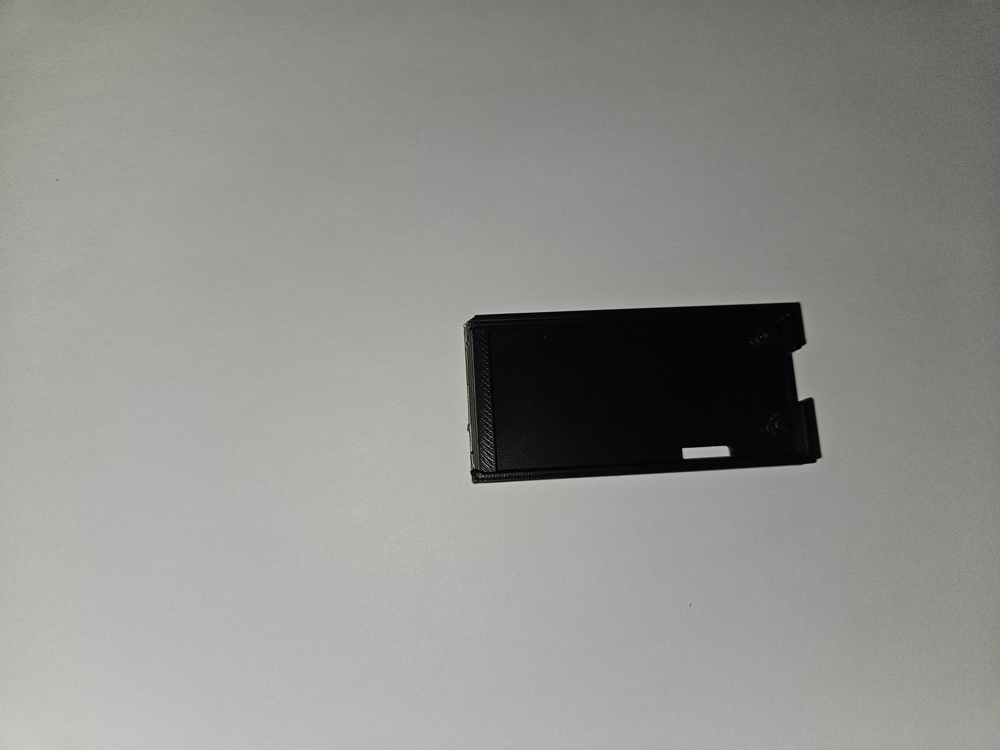
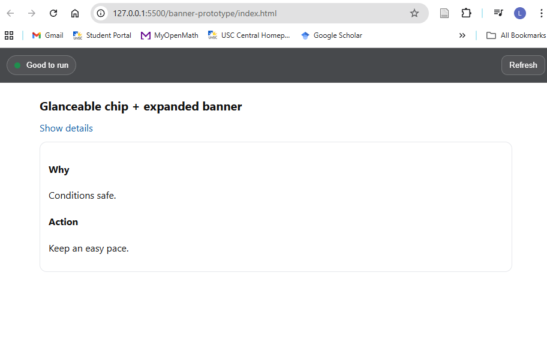
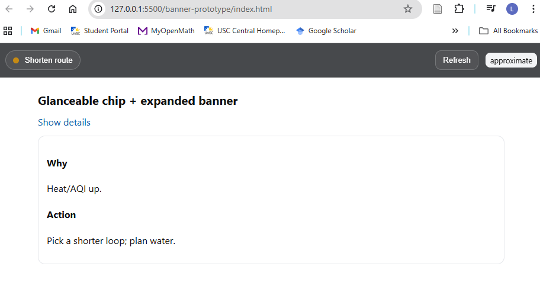
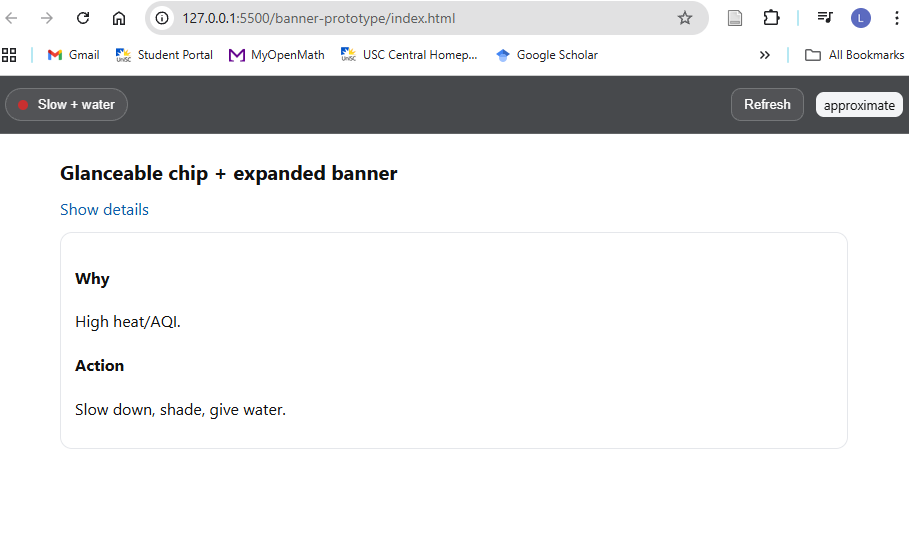
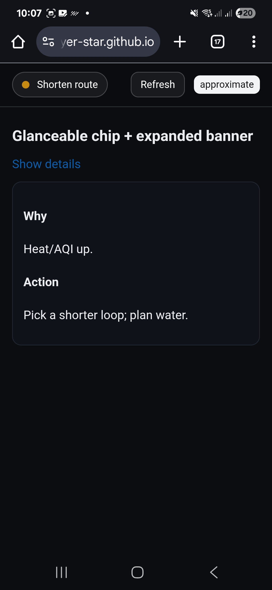

**Navigation:** [Home](/Process-Journal-Task-2/) · [Materials](/Process-Journal-Task-2/materials.html) · [Week 6](/Process-Journal-Task-2/weeks/week6.html) · [Week 7](/Process-Journal-Task-2/weeks/week7.html) · [Week 8](/Process-Journal-Task-2/weeks/week8.html) · [Week 9](/Process-Journal-Task-2/weeks/week9.html) · [Week 10](/Process-Journal-Task-2/weeks/week10.html) · [Week 11](/Process-Journal-Task-2/weeks/week11.html) · [Week 12](/Process-Journal-Task-2/weeks/week12.html) · [Week 13](/Process-Journal-Task-2/weeks/week13.html) · [Week 14](/Process-Journal-Task-2/weeks/week14.html)

# Week 11 — Pivot to ESP32, local sensors, and housing print

I pivoted from the RP2040 plan to the SparkFun Thing Plus ESP32 (USB-C) for native BLE and simpler 3.3 V I²C. I paired PiicoDev ENS160 (eCO₂/TVOC) and TMP117 (temperature), and printed a soft-edged PLA housing with a slide-switch window for a lower-chest mount.

---

## Why the pivot (from Week 10)
- Built-in BLE removed a whole module and extra wiring.
- Compact I²C sensors (ENS160 + TMP117) simplified cabling and libraries.
- Same single-LED mirror pattern, but cleaner and easier to expand.

---

## What I built

### Board
SparkFun Thing Plus ESP32 (BLE/USB-C). Chosen for native BLE and simple 3.3 V power.

### Sensors
PiicoDev ENS160 (eCO₂/TVOC) + TMP117 (temperature) over I²C via QT/STEMMA. Keyed cables; stable support.

### Indicator
Diffused RGB LED on GPIO 13/12/14 with 220–330 Ω resistors. Solid colours only (no flashing) for glanceability and battery life.

### Enclosure
PLA print with rounded edges, mounted lower on the chest. Lid/backplate includes a slide-switch window. No on-dog charging.

---

## Parts and prints (photos)

<figure>
  
  <figcaption>Post-pivot parts: ESP32 Thing Plus, ENS160, TMP117, LiPo, QT lead.</figcaption>
</figure>

<figure>
  
  <figcaption>Internals: standoffs, wire channel, and a pocket for the slide switch/light pipe.</figcaption>
</figure>

<figure>
  
  <figcaption>Cable relief to avoid strain; battery space kept clear of the switch.</figcaption>
</figure>

<figure>
  
  <figcaption>Lid/backplate with switch slot; tolerances checked against the board.</figcaption>
</figure>

<figure>
  
  <figcaption>Printed backplate: switch window gives positive tactile feel but resists accidental bumps.</figcaption>
</figure>

<figure>
  
  <figcaption>Variants A/B/C tested for strap fit, wall thickness, and switch clearance.</figcaption>
</figure>

<figure>
  
  <figcaption>LiPo test-fit: no rattle; battery removed to charge (no on-dog charging).</figcaption>
</figure>

---

## Rule v2 (local CO₂ + temperature)

Choose the worst of the two signals. Conservative while running with a dog.

```pseudo
state = "Good to run"

if co2_ppm >= 1200 or temp_c >= 32:
    state = "Slow + water break"
elif co2_ppm >= 800 or temp_c >= 28:
    state = "Shorten route"
else: Good to run


Optional near-boundary behaviour: a small dog-factor multiplier (e.g., ×1.05 for heavy coat/age) can bump the state up one level.

Tests and observations

Placement: lower-chest mount stayed stable over a 5–10 min walk/jog.

Visibility: LED readable at ~1–2 m; chip alone often enough; banner opened on demand.

Copy: stronger Alert wording improved compliance.

Near-boundary behaviour (optional): apply a small dog-factor multiplier (e.g., ×1.05 for heavy coat/age) to bump the state up one level when close to thresholds.

<p><em>These thresholds map to the three UI states shown below.</em></p> <div class="img-row"> <figure>  <figcaption><em>Good</em> — Conditions safe. Keep an easy pace.</figcaption> </figure> <figure>  <figcaption><em>Shorten route</em> — Heat/AQI up. Plan a water stop.</figcaption> </figure> <figure>  <figcaption><em>Slow + water</em> — High heat/AQI. Slow down, shade, give water.</figcaption> </figure> </div> <style> .img-row{display:flex;gap:12px;flex-wrap:wrap;margin:8px 0} .img-row figure{flex:1 1 280px;margin:0} .img-row img{width:100%;height:auto;border-radius:8px} .img-row figcaption{font-size:.9rem;color:#4b5563;margin-top:6px} </style>

## Phone screenshots (UI states)

<div class="img-row">
  <figure>
    
    <figcaption><em>Good</em> — Conditions safe. Keep an easy pace.</figcaption>
  </figure>

  <figure>
    
    <figcaption><em>Shorten route</em> — Heat/AQI up. Pick a shorter loop; plan water.</figcaption>
  </figure>

  <figure>
    
    <figcaption><em>Slow + water</em> — High heat/AQI. Slow down, shade, give water.</figcaption>
  </figure>
</div>

<style>
.img-row{display:flex;gap:12px;flex-wrap:wrap;margin:8px 0}
.img-row figure{flex:1 1 280px;margin:0}
.img-row img{width:100%;height:auto;border-radius:8px}
.img-row figcaption{font-size:.9rem;color:#4b5563;margin-top:6px}
</style>


Next (Week 12)

Wire and flash the final test firmware; log CO₂/Temp → state.

Print the preferred housing variant and fit to harness.

Capture short state-transition clips for the showreel.