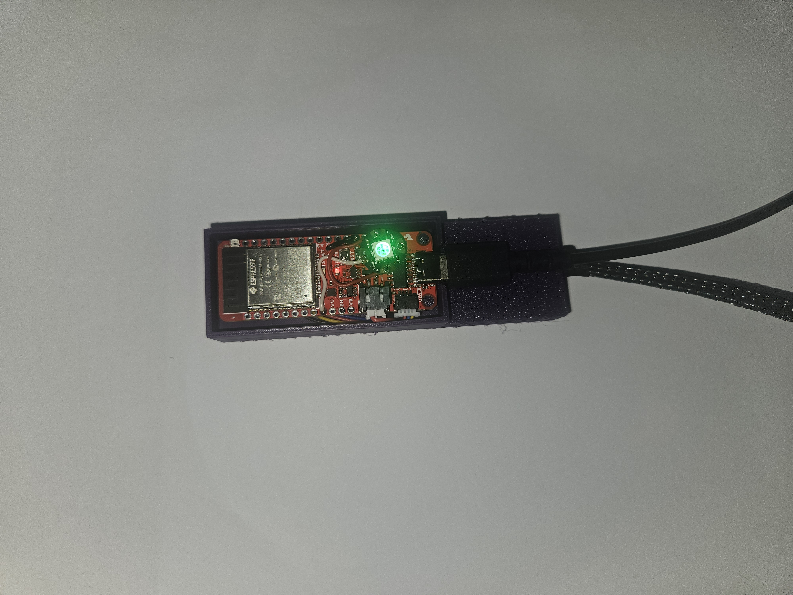
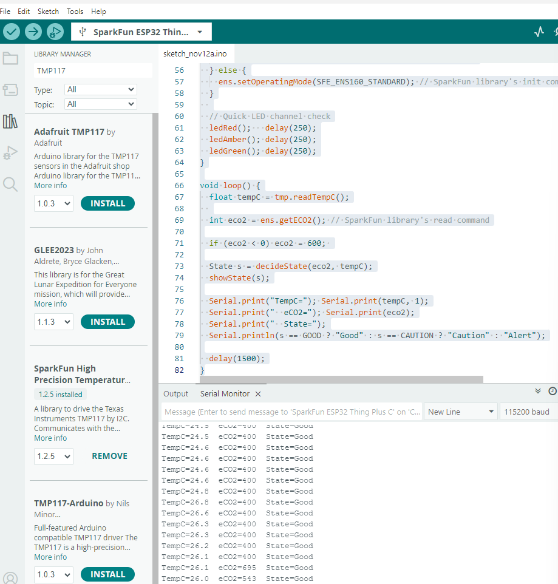

**Navigation:** [Home](/Process-Journal-Task-2/) · [Materials](/Process-Journal-Task-2/materials.html) · [Week 6](/Process-Journal-Task-2/weeks/week6.html) · [Week 7](/Process-Journal-Task-2/weeks/week7.html) · [Week 8](/Process-Journal-Task-2/weeks/week8.html) · [Week 9](/Process-Journal-Task-2/weeks/week9.html) · [Week 10](/Process-Journal-Task-2/weeks/week10.html) · [Week 11](/Process-Journal-Task-2/weeks/week11.html) · [Week 12](/Process-Journal-Task-2/weeks/week12.html) · [Week 13](/Process-Journal-Task-2/weeks/week13.html) · [Week 14](/Process-Journal-Task-2/weeks/week14.html)

# Week 12 — Build, code, and final print tests

This week I assembled the hardware, flashed the ESP32 with the simple “worst-of-two” rule (eCO₂ + temperature → 3 states), verified LED colours while moving, and printed the enclosure variant that fits the lower-chest mount.

<figure>
  
  <figcaption>Figure 12.1. Main enclosure internals during LED test (NeoPixel green = Good).</figcaption>
</figure>

<figure>
  
  <figcaption>Figure 12.2. Serial monitor while walking around the house; state changes match the rule.</figcaption>
</figure>

---

## Wiring (ESP32 Thing Plus → sensors + LED)

### I²C (QT / STEMMA)
- 3V3 → sensor VCC  
- GND → sensor GND  
- SDA (GPIO 21) → ENS160/TMP117 SDA  
- SCL (GPIO 22) → ENS160/TMP117 SCL

### NeoPixel LED (WS2812 single pixel)
- V+ → 3.3 V (safe for one pixel; keep brightness low)  
- GND → GND (shared with ESP32)  
- DIN → GPIO 13  
- Optional: 330 Ω in series on DIN; 100–1000 µF across V+/GND near LED

---

## Thresholds v2.1 (tuned)

Decision rule picks the worst of the two signals.

- Slow + water break when eCO₂ ≥ 1250 ppm or temp ≥ 33 °C  
- Shorten route when eCO₂ ≥ 820 ppm or temp ≥ 29 °C  
- Else Good to run

---

## Firmware (Arduino)

Board: SparkFun ESP32 Thing Plus (ESP32 Arduino core)  
Libraries: `Wire.h`, `SparkFun_TMP117.h`, `SparkFun_ENS160.h`, `Adafruit_NeoPixel.h`

```cpp
#include <Wire.h>
#include <SparkFun_TMP117.h>
#include <SparkFun_ENS160.h>
#include <Adafruit_NeoPixel.h>

// NeoPixel (single LED)
#define NEOPIXEL_PIN   13
#define NUM_PIXELS     1
#define BRIGHTNESS     30
Adafruit_NeoPixel pixel(NUM_PIXELS, NEOPIXEL_PIN, NEO_GRB + NEO_KHZ800);

// Sensors
TMP117 tmp;
SparkFun_ENS160 ens;

// Thresholds v2.1
const int   CO2_CAUTION = 820;
const int   CO2_ALERT   = 1250;
const float T_CAUTION   = 29.0;
const float T_ALERT     = 33.0;

enum State { GOOD, CAUTION, ALERT };

void pxOff()   { pixel.clear(); pixel.show(); }
void pxRed()   { pixel.setPixelColor(0, pixel.Color(255,   0,   0)); pixel.show(); }
void pxGreen() { pixel.setPixelColor(0, pixel.Color(  0, 180,   0)); pixel.show(); }
void pxAmber() { pixel.setPixelColor(0, pixel.Color(255, 120,   0)); pixel.show(); }

State decideState(int eco2, float tempC) {
  if (eco2 >= CO2_ALERT   || tempC >= T_ALERT)   return ALERT;
  if (eco2 >= CO2_CAUTION || tempC >= T_CAUTION) return CAUTION;
  return GOOD;
}

void showState(State s) {
  switch (s) {
    case GOOD:    pxGreen(); break;
    case CAUTION: pxAmber(); break;
    case ALERT:   pxRed();   break;
  }
}

void setup() {
  Serial.begin(115200);
  Wire.begin();            // SDA=21, SCL=22 on Thing Plus

  pixel.begin();
  pixel.setBrightness(BRIGHTNESS);
  pxOff();

  if (!tmp.begin()) Serial.println("TMP117 not found (check I2C).");
  if (!ens.begin()) Serial.println("ENS160 not found (check I2C).");
  else              ens.setOperatingMode(SFE_ENS160_STANDARD);

  // quick colour check
  pxRed(); delay(300); pxAmber(); delay(300); pxGreen(); delay(300); pxOff(); delay(150);
}

void loop() {
  float tempC = tmp.readTempC();
  int   eco2  = ens.getECO2();
  if (eco2 < 0) eco2 = 600;             // warm-up fallback

  State s = decideState(eco2, tempC);
  showState(s);

  Serial.print("TempC="); Serial.print(tempC, 1);
  Serial.print("  eCO2="); Serial.print(eco2);
  Serial.print("  State=");
  Serial.println(s == GOOD ? "Good" : s == CAUTION ? "Caution" : "Alert");

  delay(1500);
}
hysical build and mounting

Print settings (Bambu P1S, PLA): 0.20 mm layer height; 3 walls (~1.2 mm); 4–5 top/bottom; 15–20% gyroid.
Orientation: backplate flat; housing upright with minimal supports at the switch window.
Post-process: light deburr on strap faces; no sharp edges.

Assembly checks:

Slide switch travel is positive and hard to bump.

Battery is snug; remove to charge (no on-dog charging).

LED is visible at ~1–2 m.

Nothing rigid over the trachea; lower-chest position is comfortable.

Remote sensor pod: the air-quality/temperature sensor lives in a small vented pod at the end of the braided cable, closer to the chest and away from the main electronics.

Field checks (log template)

22 Oct, 7:15 am — temp __ °C, eCO₂ __ → Good to run
Notes: LED visibility, copy clarity, any confusion.

22 Oct, 5:10 pm — temp __ °C, eCO₂ __ → Shorten route
Notes: water/route prompt useful? stability near boundary?

23 Oct, 1:05 pm — temp __ °C, eCO₂ __ → Slow + water break
Notes: shade stop helpful? any latency?

What worked and what’s next

The rule feels predictable, LED readability is good in motion.
Next week: minor threshold/copy tweaks from logs, soften enclosure edges, capture a short state-transition clip for the showreel.