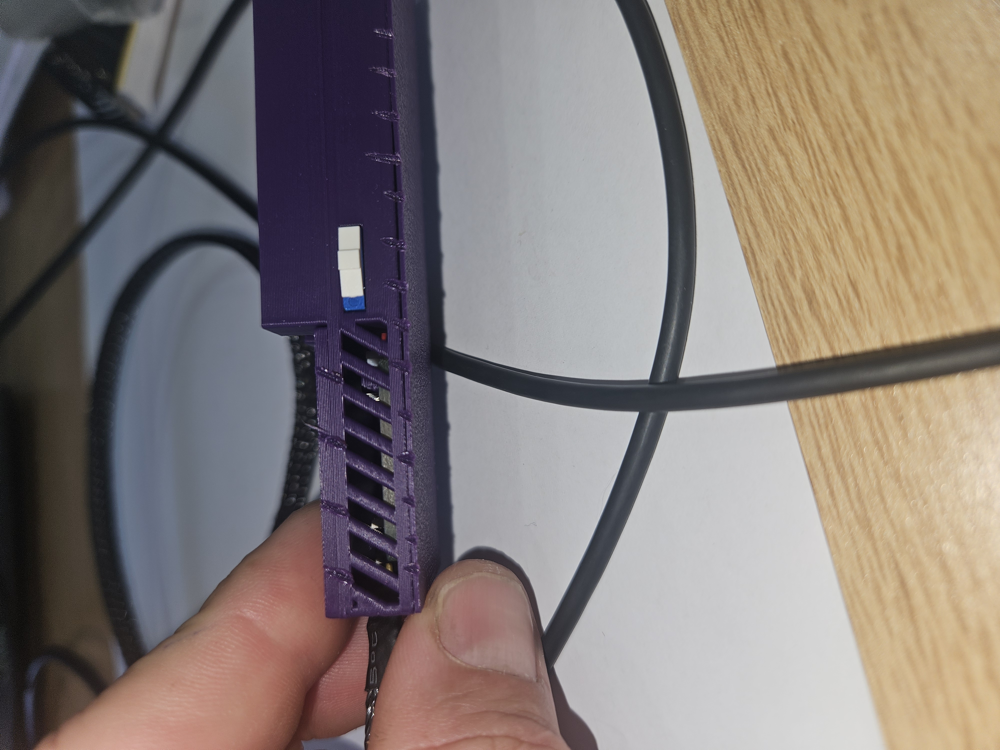

**Navigation:** [Home](/Process-Journal-Task-2/) · [Materials](/Process-Journal-Task-2/materials.html) · [Week 6](/Process-Journal-Task-2/weeks/week6.html) · [Week 7](/Process-Journal-Task-2/weeks/week7.html) · [Week 8](/Process-Journal-Task-2/weeks/week8.html) · [Week 9](/Process-Journal-Task-2/weeks/week9.html) · [Week 10](/Process-Journal-Task-2/weeks/week10.html) · [Week 11](/Process-Journal-Task-2/weeks/week11.html) · [Week 12](/Process-Journal-Task-2/weeks/week12.html) · [Week 13](/Process-Journal-Task-2/weeks/week13.html) · [Week 14](/Process-Journal-Task-2/weeks/week14.html)

# Week 13 — Tweaks, tuning, polish

This week I tuned thresholds using Week 12 logs, cleaned the enclosure edges, improved the LED diffuser seat, and captured short state-transition clips for the final edit.

---

## Threshold tuning (stability near boundaries)

Late-arvo tests showed occasional bouncing around the Caution boundary. I widened the gap slightly to keep the LED and banner stable without losing conservatism.

- Slow + water break: `eCO₂ ≥ 1250 ppm` **or** `temp ≥ 33 °C`  
- Shorten route: `eCO₂ ≥ 820 ppm` **or** `temp ≥ 29 °C`  
- Else: Good to run

Rationale: safety-first; small nudges reduce flip-flopping when readings hover near 28–29 °C or ~800 ppm.

---

## Copy refinements (faster to parse)

- Caution — “Pick a shorter loop; plan a water stop.”  
- Alert — “Slow down now, move to shade, give water.”  
- Good — unchanged (short, calm language still works best).

---

## Enclosure polish

- Added a 0.5 mm recessed diffuser seat so the LED sits flush (less hotspot).  
- Filleted the switch slot corners by +0.3 mm (less snagging on straps).  
- Softened backplate edges and added a thin EVA strip against the harness.

### LED diffuser seat detail

<figure>
  
  <figcaption><strong>Figure 13.2.</strong> Backplate with a new circular cut-out for the LED diffuser alongside the round LED PCB before installation.</figcaption>
</figure>

<figure>
  
  <figcaption><strong>Figure 13.3.</strong> Round LED PCB mounted in the recessed diffuser seat so the light sits flush and spreads more evenly across the front panel.</figcaption>
</figure>

### Venting and cable exit

<figure>
  
  <figcaption><strong>Figure 13.4.</strong> Side view of the enclosure showing angled vent slots over the electronics, the braided cable exit, and the low-profile switch position. This layout keeps the housing breathable while avoiding any hard edges against the dog.</figcaption>
</figure>

---

## Harness mounting

I mounted the finished enclosure on my existing EzyDog running harness to check how it sits on the dog’s chest, how much it moves while running, and whether any edges dig in.

<figure>
  
  <figcaption><strong>Figure 13.1.</strong> Existing EzyDog running harness used as the base for mounting the electronics enclosure and remote sensor pod on the lower chest strap.</figcaption>
</figure>

The lower-chest position keeps the trachea clear and makes the LED visible to the runner while still leaving room for an optional phone pouch on the back.

---

## Short test notes (field)

- 25 Oct, 7:05 am — 20.1 °C, eCO₂ 610 → Good  
  Notes: chip alone sufficient; LED visible peripherally.

- 25 Oct, 5:30 pm — 29.3 °C, eCO₂ 840 → Caution  
  Notes: stable (no bouncing); “plan a water stop” prompt helpful.

- 26 Oct, 12:50 pm — 33.4 °C, eCO₂ 1210 → Alert (temp-driven)  
  Notes: red LED decisive; moved to shade and gave water.

---

## Evidence checklist (photos to add later)

When I have time I’ll add more build/detail photos. Planned shots:

  
- `week13-switch-slot-fillet.jpg` — macro shot of the switch slot showing the small corner fillets that reduce strap snagging.  
- `week13-strap-fit.jpg` — housing mounted on the lower chest strap showing rounded edges and EVA backing.  
- `week13-state-transition-clip-still.jpg` — still frame from a state-transition clip (Good → Caution or Caution → Alert) with the LED colour change visible.

---

## Ready for Week 14

- Hardware: printed, assembled, and comfortable in use.  
- Firmware: thresholds v2.1 applied; LED mirror stable.  
- Media: have multiple short clips; next is the final 1–3 min showreel and submission packaging.
