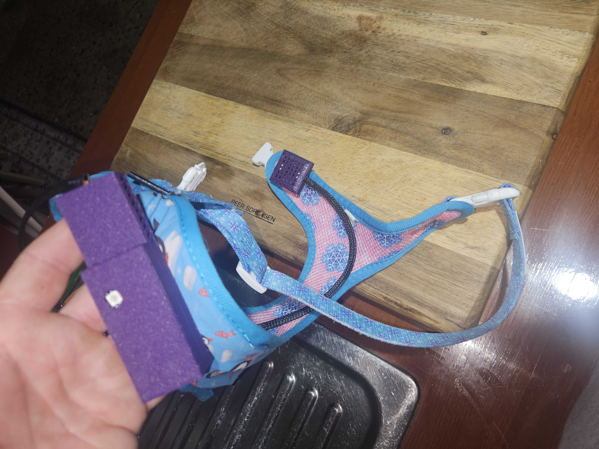

**Navigation:** [Home](/Process-Journal-Task-2/) · [Week 6](/Process-Journal-Task-2/weeks/week6.html) · [Week 7](/Process-Journal-Task-2/weeks/week7.html) · [Week 8](/Process-Journal-Task-2/weeks/week8.html) · [Week 9](/Process-Journal-Task-2/weeks/week9.html) · [Week 10](/Process-Journal-Task-2/weeks/week10.html) · [Week 11](/Process-Journal-Task-2/weeks/week11.html) · [Week 12](/Process-Journal-Task-2/weeks/week12.html) · [Week 13](/Process-Journal-Task-2/weeks/week13.html) · [Week 14](/Process-Journal-Task-2/weeks/week14.html)

# Week 14 — Final prototype & showreel

This week I locked the build, captured the final footage, and exported the **Task 3 showreel**.

---

## Final video

<video controls width="100%">
  <source src="../assets/videos/DES222-Task3-Showreel-WyerLiam-v1-2025-11-14.mp4" type="video/mp4">
  Your browser does not support the video tag.
</video>

*Filename:* `DES222-Task3-Showreel-WyerLiam-v1-2025-11-14.mp4`  
*Where:* `assets/videos/`

---

## Final build (summary)

- **Board:** SparkFun ESP32 Thing Plus (USB-C), I²C to sensors.
- **Sensors:** SparkFun ENS160 (eCO₂/TVOC) + SparkFun TMP117 (temperature).
- **Indicator:** 1× NeoPixel (WS2812) as a glanceable state LED (green/amber/red).
- **Rule:** pick the worst of `eCO₂` or `temp` using thresholds tuned in Week 13:
  - **Alert** → `eCO₂ ≥ 1250 ppm` or `temp ≥ 33 °C`
  - **Caution** → `eCO₂ ≥ 820 ppm` or `temp ≥ 29 °C`
  - **Good** otherwise
- **Enclosure:** PLA, soft-edged, lower-chest mount; backplate snaps; external slide switch.
- **Power:** 3.7 V LiPo → board 3V3; cable-sleeved pigtail to a small sensor cap.

---

## Photos (final evidence)

<section>
  <h2>Photos (final evidence)</h2>

  <figure>
    
    <figcaption>Mounted on harness (lower-chest). LED window visible at ~1–2 m.</figcaption>
  </figure>

  <figure>
    
    <figcaption>Final assembly powered on; sensor cap on sleeved pigtail.</figcaption>
  </figure>
</section>

> **Save these in** `assets/images/`
> - `week14-mounted-on-harness-01.jpg`  ← your photo: <em>week14_mounted_on_small_harness.jpg</em>  
> - `week14-full-assembly-led-01.jpg`   ← your photo: <em>week14_full_assembly_led_table.jpg</em>

---

## What the video shows

1) **Context & goal** — quick problem framing (safe running with dog).  
2) **UI** — chip + expanded banner; 3 states with short “Why/Action”.  
3) **Hardware** — enclosure, mount, wiring, LED mirror.  
4) **Rule demo** — state transitions via real sensor readouts.  
5) **Takeaways** — thresholds feel conservative but actionable; LED readable in motion.

---

## Reflection

- The **glanceable LED** removed the need to stare at the phone; colours were readable even at jogging pace.  
- The **expanded banner** (tap-to-open) worked better than auto-expanding.  
- The **lower-chest mount** kept rigid parts away from the trachea and reduced bounce.  
- For a next pass I would: add a tiny **“reason” blip** over BLE (for phone log), longer-life cell, and gasket for drizzle.

---

## Submission items

- Final showreel (above) placed at: `assets/videos/DES222-Task3-Showreel-WyerLiam-v1-2025-11-14.mp4`
- Updated materials (BOM) with actual parts and sources: [/materials](/Process-Journal-Task-2/materials.html)
- Week 6–14 journal entries (this page is the Week 14 entry).

