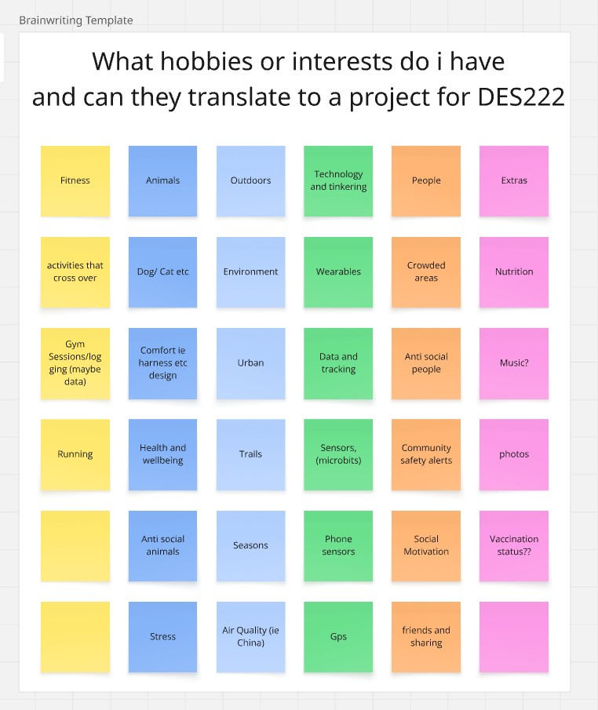
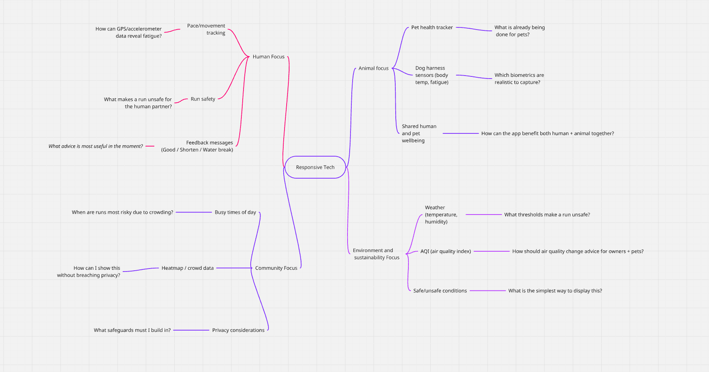

**Navigation:** **Navigation:** [Home](/Process-Journal-Task-2/) · [Week 6](/Process-Journal-Task-2/weeks/week6.html) · [Week 7](/Process-Journal-Task-2/weeks/week7.html) · [Week 8](/Process-Journal-Task-2/weeks/week8.html) · [Week 9](/Process-Journal-Task-2/weeks/week9.html) · [Week 10](/Process-Journal-Task-2/weeks/week10.html) · [Week 11](/Process-Journal-Task-2/weeks/week11.html)

# Week 6 — Ideation & framing

## Early Brainstorming

  
*Figure 1. Initial brainstorm using post-it notes to capture raw ideas across human, animal, environmental, and community factors.*

*Reflection:*  
The post-it brainstorm was a fast way to throw out lots of raw ideas without worrying about feasibility. It helped me surface themes around animal wellbeing, human safety, environmental conditions and community use. Seeing everything laid out visually also made it easier to notice overlaps. This messy stage gave me a starting point to organise ideas more systematically.

---

## Mind Map

  
*Figure 2. Mind map of early ideas with guiding questions (e.g. “What makes a run unsafe?”) showing exploration across Human, Animal, Community, and Environmental branches.*

*Reflection:*  
The mind map let me take those scattered post-it ideas and group them into four clear categories: Human, Animal, Community and Environment. Adding guiding questions under each branch helped me push the ideas further and check which directions had depth. For example, asking “What thresholds make a run unsafe?” pointed me toward environmental data while “Which biometrics are realistic to capture?” highlighted body temperature as a possible input. This process narrowed my focus to a project that combines multiple branches rather than just one.

---

## Idea Card
**Adaptive Run Companion – Liam Wyer**  
Most likely a solo project.  
**Form** – Mobile app (possible wearable extension)  
**Configuration** – Human + Nonhuman (shared run)  
**Inputs** – GPS location, pace/movement data, weather + air quality API, and optional body temperature (dog)  
**Outputs** – Advisory feedback via on-screen banner alerts (e.g. *“Good to run”*, *“Shorten route”*, *“Slow + water break”*)  

This is a responsive running companion for people and their dogs. It adapts runs to heat, humidity and air quality with suggestions to slow, shorten or take water. If pace is steady, it encourages continuing. Future: anonymous “busy time” alerts with strict user preference–based privacy.

---

## Provocation & Intent
- **Chosen provocation:** *Beyond Human*  
- **Problem/context:** Running with dogs can be unsafe in heat, humidity or poor air quality; owners lack simple, real-time guidance.  
- **Audience:** Recreational runners who take their dog on daily runs.  
- **Design intent:** Provide adaptive, context-aware advice that keeps both human and dog safer and more comfortable during runs.

## Concept Directions
1. **Direction A — Adaptive Run Companion (mobile web):**  
   Uses GPS + weather/AQI + optional body temperature (dog) to adjust pacing and suggest water/shade breaks. Provides digital on-screen banner alerts such as *“Slow down + water break”* or *“Shorten route”*.  

2. **Direction B — Community-aware alerts:**  
   Collects anonymous, privacy-safe “busy/heat” pings aggregated by area and time to recommend quieter/cooler windows. Only activates if multiple users contribute, protecting privacy.

3. **Direction C — Wearable harness add-on (later):**  
   Optional dog harness sensor to refine fatigue/overheating cues. Could directly feed body temperature or movement data into the app for more accurate alerts.

*Selected:* **A** for Week 9 demo; **B** as a light extension.

---

## Interaction loop
**Sense → Decide → Act → Reflect**  
- **Inputs:** GPS, weather/AQI APIs, simple pace trend  
- **Rules:** if `heatIndex ≥ threshold` → suggest slow/shorten/water  
- **Outputs:** on-screen banner alert; optional haptic (device)  
- **Feedback:** user taps “took water/shortened run” to improve advice

---

## Notes & Decisions
- Start as **mobile web** (Geolocation + public weather API).  
- Privacy-by-design for any community pings (opt-in, geohash rounding, k-anonymity, no history).  
- **Feasibility:** live weather-driven alerts + mock heatmap for Week 9.

---

## Reflection
This shifts me away from “medical pet tracking” into a shared, situational experience. It foregrounds human factors (safety, comfort, timing) and applies design principles (clarity, timely feedback). Next I’ll validate thresholds for heat/AQI and the wording of alerts.
