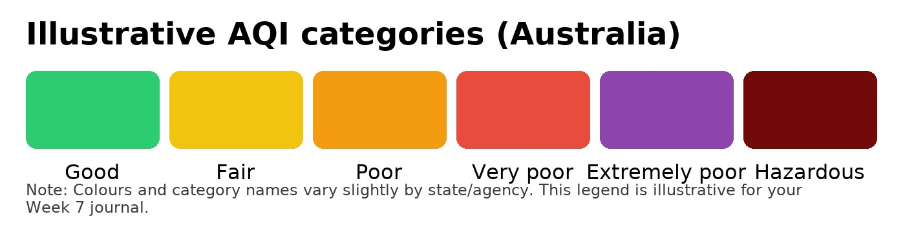
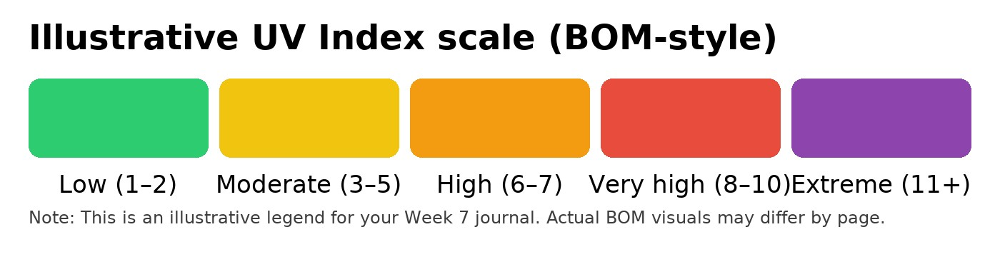
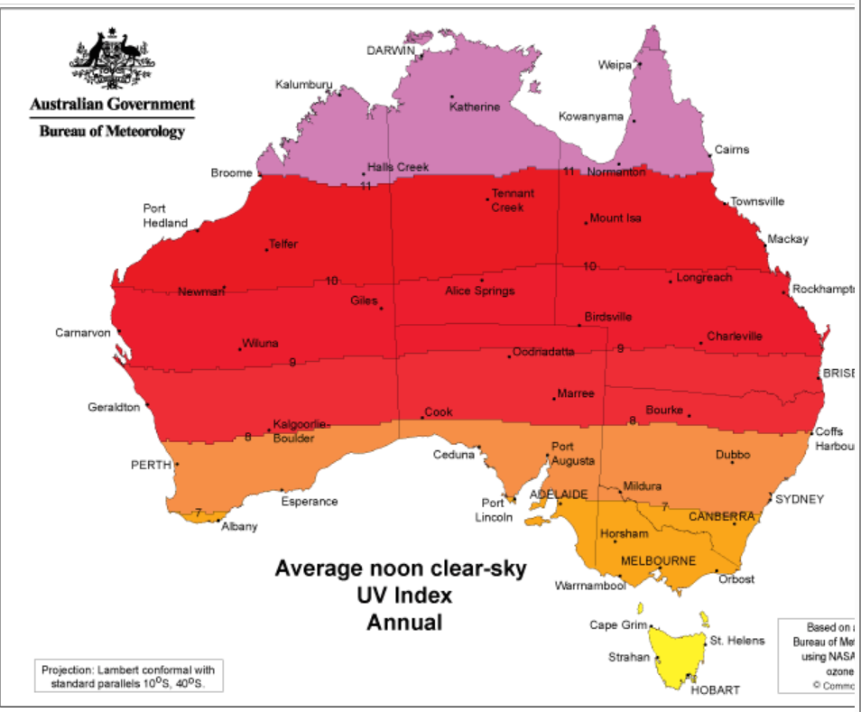

**Navigation:** [Home](/Process-Journal-Task-2/) · [Week 6](/Process-Journal-Task-2/weeks/week6.html) · [Week 7](/Process-Journal-Task-2/weeks/week7.html) · [Week 8](/Process-Journal-Task-2/weeks/week8.html) · [Week 9](/Process-Journal-Task-2/weeks/week9.html) · [Week 10](/Process-Journal-Task-2/weeks/week10.html) · [Week 11](/Process-Journal-Task-2/weeks/week11.html) · [Week 12](/Process-Journal-Task-2/weeks/week12.html) · [Week 13](/Process-Journal-Task-2/weeks/week13.html) · [Week 14](/Process-Journal-Task-2/weeks/week14.html)

# Week 7 — Related works & research

## Landscape scan

### Crowd heatmaps in running apps
  
*Strava Global Heatmap showing running and cycling activity across Brisbane and surrounding areas.*

The Strava Global Heatmap visualises where users run and cycle most often. Each line on the map represents GPS traces from thousands of workouts uploaded by Strava users. Brighter and denser blue lines indicate heavily used routes, while fainter lines show less popular paths. This kind of crowd-sourced data helps identify safe, well-travelled areas or highlight quieter routes depending on a runner’s needs. This inspired my idea of giving runners a “busy time” or “quiet path” alert, since density information can shape decisions about when and where to run. 

However, Strava’s 2018 heatmap also revealed sensitive military base locations because even anonymised data can still expose private patterns when zoomed in (Hsu, 2018). This highlighted for me the importance of only using coarse, aggregated data in my project, never precise trails or individual locations.

### Pet wearables (FitBark vs Fi)
These are commercially available pet wearables that owners can buy today. FitBark represents the “activity/health logger” model (up-front hardware, no subscription). Fi represents the “live GPS recovery” model (hardware plus monthly plan over LTE-M). Looking at both establishes the current baseline for features, costs and privacy trade-offs and shows where my concept would fit. Key takeaway: neither provides real-time environmental safety guidance during a run or considers combined human + dog risk — that gap motivates my prototype.

  
*FitBark 2 — one-off purchase activity tracker focusing on health and movement stats.*

  
*Fi Smart Collar — subscription-based GPS tracker with LTE-M connectivity for live location.*

FitBark is a one-off purchase device that tracks a dog’s activity, rest, and general health trends. It is designed for logging and longer-term insights rather than in-moment intervention (FitBark, n.d.).

Fi uses a subscription model to provide live GPS tracking (LTE-M) for locating dogs in real time. This offers location safety but introduces an ongoing cost and like most GPS devices, typically trades off battery life for continuous tracking (Fi, n.d.).

#### Pros and cons at a glance
- FitBark — pros: no subscription, simple setup; cons: no live GPS and no real-time safety prompts during exercise.  
- Fi — pros: live GPS for recovery/safety; cons: monthly fee and still no alerts about heat, humidity, or air-quality risk while running.

#### Design implications for my project
- Focus on in-moment guidance (heat, humidity, AQI) rather than historical dashboards.  
- Keep costs low and avoid subscriptions by leveraging the user’s phone and public data sources.  
- Minimise data collection: do not store trails or IDs; use only coarse, ephemeral data needed for guidance.

### Competitive gap and what I will do differently
1. **Real-time safety prompts, not dashboards**  
   FitBark logs activity trends and Fi focuses on location recovery. My concept gives in-moment guidance during a run based on current heat, humidity and air quality, plus simple actions (good to run / shorten route / slow + water break).

2. **Human + dog combined risk**  
   Allow dog factors (size, age, coat, breed sensitivities) to adjust thresholds. Guidance is framed for both runner and dog.

3. **No subscription; phone-only**  
   Use the phone’s geolocation and publicly available weather/AQI data. Keep the core experience free and lightweight.

4. **Privacy by design**  
   No trails or accounts. Do calculations on-device; only fetch coarse, nearest-station data. Label data as approximate and provide a manual refresh.

5. **Battery-friendly vs constant GPS**  
   Avoid continuous GPS like Fi. Use coarse location on demand and event-based checks (e.g., every few minutes, or when distance/conditions change).

6. **Clear, glanceable UI**  
   One-line status chip that expands to a short banner with the why and a single recommended action. Progressive disclosure for details.

7. **Ethical + accessible defaults**  
   Conservative thresholds, plain language, high-contrast option, optional haptics/sound for attention and dog-first rest/water timers.

### Comparative table

<table>
  <thead>
    <tr>
      <th>Criterion</th>
      <th>FitBark</th>
      <th>Fi Smart Collar</th>
      <th>My concept (Adaptive Run Companion)</th>
    </tr>
  </thead>
  <tbody>
    <tr><td>Business model</td><td>One-off device purchase</td><td>Subscription for live GPS</td><td>Free/low-cost phone app</td></tr>
    <tr><td>Primary value</td><td>Activity/health logging</td><td>Live location recovery</td><td>Real-time safety prompts</td></tr>
    <tr><td>Location tracking</td><td>No live GPS</td><td>Live GPS (LTE-M)</td><td>Coarse phone geolocation only</td></tr>
    <tr><td>Environmental risk (heat/AQI)</td><td>Not addressed</td><td>Not addressed</td><td>Core input to guidance</td></tr>
    <tr><td>Data stored</td><td>Historical activity trends</td><td>Location history (service)</td><td>No trails; ephemeral on device</td></tr>
    <tr><td>Privacy posture</td><td>Standard app analytics</td><td>Service account + GPS</td><td>Privacy-first; no IDs/accounts</td></tr>
    <tr><td>Battery impact</td><td>Low</td><td>Higher (continuous GPS)</td><td>Low (event-based checks)</td></tr>
    <tr><td>Cost to user</td><td>Device price</td><td>Monthly fee</td><td>No subscription</td></tr>
    <tr><td>Availability</td><td>Shipping now</td><td>Shipping now</td><td>Prototype (phone app)</td></tr>
    <tr><td>Audience fit</td><td>Wellness tracking</td><td>Anti-lost safety</td><td>Runners with dogs seeking safe sessions</td></tr>
  </tbody>
</table>

*(Evidence sources for later reference list: FitBark product page; Fi product page and pricing; pages accessed 13 Sep 2025.)*

### Weather/AQI risk guidance

  
*Example AQI categories used by Australian agencies (Good → Hazardous).*

  
*Bureau of Meteorology alert styles for heat/UV.*

  
*Average noon clear-sky UV Index (annual), Australian Bureau of Meteorology. Included as context for UV exposure risk across Australia.*

Government dashboards classify air quality and heat using simple categories that are easy to translate into running guidance. I will map these categories into a three-state banner.

#### Banner mapping
- **Good to run** — AQI in “Good”; heat index below comfort threshold  
- **Shorten route** — AQI “Moderate/Unhealthy for sensitive”; heat index elevated  
- **Slow + water break** — AQI “Unhealthy+”; heat index high or rising quickly

#### Design notes
- Show an “approximate” label (nearest station ≠ exact micro-climate) and include a manual Refresh.  
- Use plain language and a single clear action; details available on expansion.  
- Start conservative; tune thresholds after Week 8 tests.

*(Screenshots to add: an AQI category chart and a BOM alert panel.)*
 

## What I’m taking forward

- **Interaction patterns:** glanceable banners, progressive disclosure.  
- **Tech:** Web Geolocation; Weather/AQI API; basic risk scoring.  
- **Human/cultural:** accessibility (clear language), privacy (no trails/IDs), animal welfare.

## Reflection

The strongest leverage is timely, clear micro-advice rather than dashboards. Privacy needs to be strict to avoid creepiness; aggregation + k-anonymity feels right. This week helped me validate that my idea has a gap compared to existing products. While other tools log data or provide static dashboards, there is little real-time advice that responds to *both* human and animal needs. I also became more aware of privacy risks, so I decided to prioritise aggregation and transparency. This learning will directly inform the rules and prototype I start in Week 8.

## References
- Hsu, J. (2018) *The Strava heat map and the end of secrets*. Wired UK, 29 January. Available at: https://www.wired.com/story/strava-heat-map-military-bases-fitness-trackers-privacy (Accessed: 13 September 2025).

- Strava (n.d.) *Global Heatmap*. Available at: https://www.strava.com/heatmap (Accessed: 13 September 2025).

- FitBark (n.d.) *FitBark 2*. Available at: https://www.fitbark.com/ (Accessed: 13 September 2025).

- Fi (n.d.) *Fi Smart Collar*. Available at: https://tryfi.com/ (Accessed: 13 September 2025).

- Bureau of Meteorology (n.d.) *Heatwave Service for Australia*. Available at: http://www.bom.gov.au/australia/heatwave/ (Accessed: 13 September 2025).

- Bureau of Meteorology (n.d.) *UV Index and Sun Protection Times*. Available at: http://www.bom.gov.au/uv/ (Accessed: 13 September 2025).

- Department of Climate Change, Energy, the Environment and Water (n.d.) *Air quality: categories and health advice*. Available at: https://www.dcceew.gov.au/ (Accessed: 13 September 2025).

