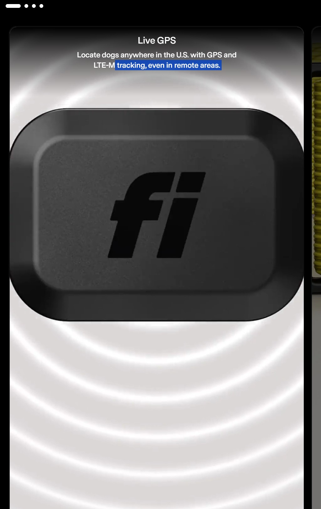

**Navigation:** [Home](/Process-Journal-Task-2/) · [Week 6](./week6) · [Week 7](./week7) · [Week 8](./week8) · [Week 9](./week9)

# Week 7 — Related works & research

## Landscape scan
1. **Crowd heatmaps in running apps** — pattern for time/zone-based density; informs my anonymous “busy time” idea.
  
*Strava Global Heatmap showing running and cycling activity across Brisbane and surrounding areas.*
The Strava Global Heatmap visualises where users run and cycle most often. Each line on the map represents GPS traces from thousands of workouts uploaded by Strava users. Brighter and denser blue lines indicate **heavily used routes**, while fainter lines show **less popular paths**. This kind of crowd-sourced data helps identify safe, well-travelled areas or highlight quieter routes depending on a runner’s needs.  

This inspired my idea of giving runners a “busy time” or “quiet path” alert, since density information can shape decisions about when and where to run. However, Strava’s 2018 heatmap also revealed sensitive military base locations because even anonymised data can still expose private patterns when zoomed in (Hsu, 2018). This highlighted for me the importance of only using **coarse, aggregated data** in my project, never precise trails or individual locations.
    
2. **Pet wearables (general)** — mostly health logging; my pivot is **shared, in-moment guidance**.
2. **Pet wearables (FitBark vs Fi)** — devices for dog health and activity tracking.

  
*FitBark 2 — a one-off purchase activity tracker for dogs, focusing on health and movement stats.*

  
*Fi Smart Collar — a subscription-based GPS tracker with LTE-M connectivity for live dog location.*

### Pet wearables (FitBark vs Fi)

  
*FitBark 2 — one-off purchase activity tracker focusing on health and movement stats.*

  
*Fi Smart Collar — subscription-based GPS tracker with LTE-M connectivity for live location.*

FitBark is a one-off purchase device that tracks a dog’s activity, rest, and general health trends. It is designed for logging and longer-term insights rather than in-moment intervention.

Fi uses a subscription model to provide live GPS tracking (LTE-M) for locating dogs in real time. This offers location safety but introduces an ongoing cost and, like most GPS devices, typically trades off battery life for continuous tracking.

Pros and cons at a glance:
- FitBark — pros: no subscription, simple setup; cons: no live GPS and no real-time safety prompts during exercise.
- Fi — pros: live GPS for recovery/safety; cons: monthly fee and still no alerts about heat, humidity, or air-quality risk while running.

Design implications for my project:
- Focus on in-moment guidance (heat, humidity, AQI) rather than historical dashboards.
- Keep costs low and avoid subscriptions by leveraging the user’s phone and public data sources.
- Minimise data collection: do not store trails or IDs; use only coarse, ephemeral data needed for guidance.

### Competitive gap and what I will do differently

1. Real-time safety prompts, not dashboards  
   FitBark logs activity trends and Fi focuses on location recovery. My concept gives in-moment guidance during a run based on current heat, humidity and air quality, plus simple actions (good to run / shorten route / slow + water break).

2. Human + dog combined risk  
   Allow dog factors (size, age, coat, breed sensitives) to adjust thresholds. Guidance is framed for both runner and dog.

3. No subscription; phone-only  
   Use the phone’s geolocation and publicly available weather/AQI data. Keep the core experience free and lightweight.

4. Privacy by design  
   No trails or accounts. Do calculations on-device; only fetch coarse, nearest-station data. Label data as approximate and provide a manual refresh.

5. Battery-friendly vs constant GPS  
   Avoid continuous GPS like Fi. Use coarse location on demand and event-based checks (e.g., every few minutes, or when distance/conditions change).

6. Clear, glanceable UI  
   One-line status chip that expands to a short banner with the why and a single recommended action. Progressive disclosure for details.

7. Ethical + accessible defaults  
   Conservative thresholds, plain language, high-contrast option, optional haptics/sound for attention, and dog-first rest/water timers.

### Comparative table

| Criterion | FitBark | Fi Smart Collar | My concept (Adaptive Run Companion) |
|---|---|---|---|
| Business model | One-off device purchase | Subscription for live GPS | Free/low-cost phone app |
| Primary value | Activity/health logging | Live location recovery | Real-time safety prompts |
| Location tracking | No live GPS | Live GPS (LTE-M) | Coarse phone geolocation only |
| Environmental risk (heat/AQI) | Not addressed | Not addressed | Core input to guidance |
| Data stored | Historical activity trends | Location history (service) | No trails; ephemeral state on device |
| Privacy posture | Standard app analytics | Service account + GPS | Privacy-first; no IDs or accounts |
| Battery impact | Low | Higher (continuous GPS) | Low (event-based checks) |
| Cost to user | Device price | Monthly fee | No subscription |
| Audience fit | Wellness tracking | Anti-lost, safety perimeter | Runners with dogs seeking safe sessions |

*(Evidence sources for later reference list: FitBark product page; Fi product page and pricing; pages accessed 13 Sep 2025.)*

These devices track activity, rest, and sometimes location for dogs. They mostly provide long-term stats, but don’t offer immediate safety advice. This gap is important: my concept focuses on *real-time nudges* during a run.   
3. **Weather/AQI risk guidance** — informs thresholds and copy for alerts.
Government AQI dashboards and running apps sometimes give “unhealthy air” warnings. I realised I could adapt this into a simple 3-tier banner system for heat, humidity, and air quality.  

## What I’m taking forward
- **Interaction patterns:** glanceable banners, progressive disclosure.  
- **Tech:** Web Geolocation; Weather/AQI API; basic risk scoring.  
- **Human/cultural:** accessibility (clear language), privacy (no trails/IDs), animal welfare.

## References
- Strava (2018). *Strava Global Heatmap Privacy Statement*. https://blog.strava.com  
- Whistle (2023). *Whistle Health Device*. https://www.whistle.com  
- Australian Government (2024). *Air Quality Index Categories*. https://www.environment.gov.au  

## Reflection
The strongest leverage is timely, clear micro-advice rather than dashboards. Privacy needs to be strict to avoid creepiness; aggregation + k-anonymity feels right. This week helped me validate that my idea has a gap compared to existing products. While other tools log data or provide static dashboards, there is little real-time advice that responds to *both* human and animal needs. I also became more aware of privacy risks, so I decided to prioritise aggregation and transparency. This learning will directly inform the rules and prototype I start in Week 8.
