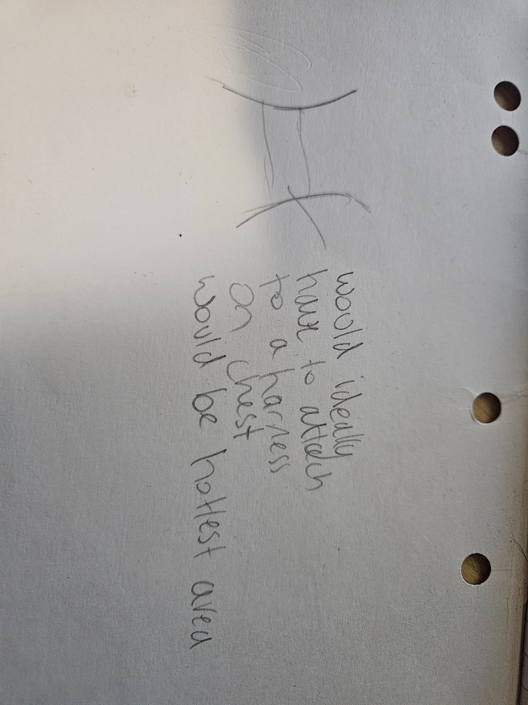
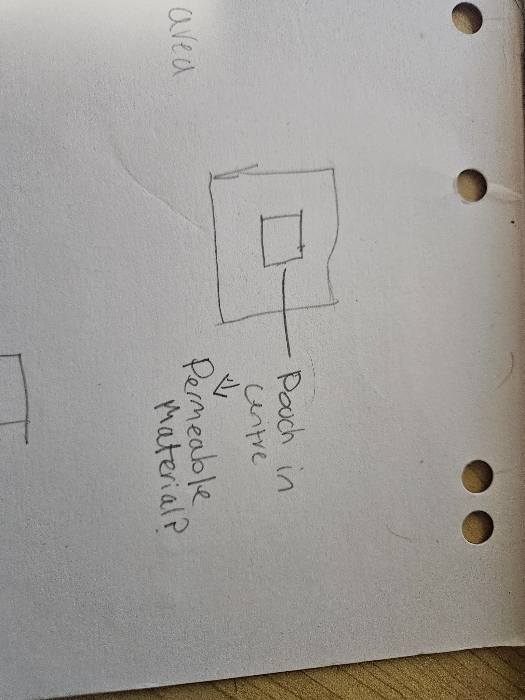
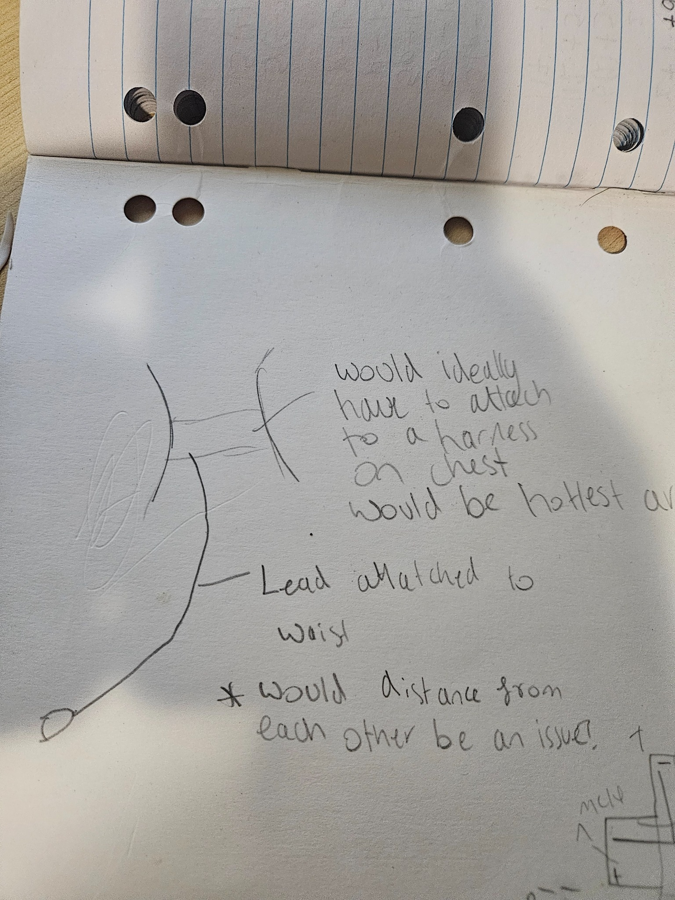
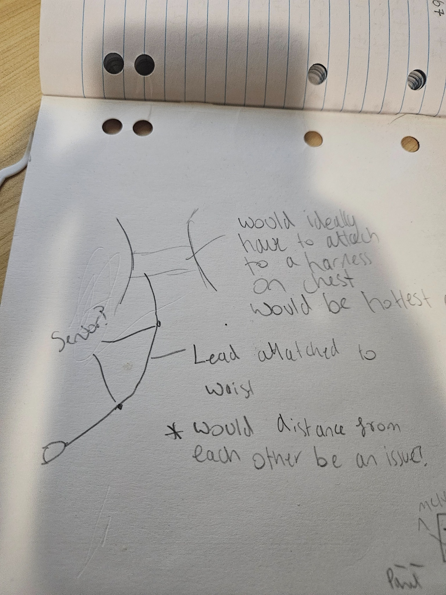

**Navigation:** [Home](/Process-Journal-Task-2/) · [Week 6](./week6.md) · [Week 7](./week7.md) · [Week 8](./week8.md) · [Week 9](./week9.md)

# Week 8 — Prototyping & tests

The step forward and planned focus this week is turning Week 7 research into a working prototype. I sketched the UI, built a first version of the state message logic and ran quick tests to see what works in motion.

### Physical concept — harness mount (sketches)

<div class="img-row">
  <figure>
    
    <figcaption>Chest mount noted as the hottest area — good for sensing heat, but watch rubbing and airflow.</figcaption>
  </figure>
  <figure>
    
    <figcaption>Centred pouch concept in breathable/mesh fabric for a small sensor puck; removable for washing.</figcaption>
  </figure>
</div>

<div class="img-row">
  <figure>
    
    <figcaption>Runner’s lead at the waist keeps hands free; check phone↔sensor BLE range (≈1–2 m) during movement.</figcaption>
  </figure>
  <figure>
    
    <figcaption>Likely sensor placement marked on chest harness. Keep edges rounded; nothing rigid over the trachea.</figcaption>
  </figure>
</div>

<style>
  .img-row{display:flex;gap:12px;flex-wrap:wrap;margin:8px 0}
  .img-row figure{flex:1 1 360px;margin:0}
  .img-row img{width:100%;height:auto;border-radius:8px}
  .img-row figcaption{font-size:.9rem;color:#4b5563;margin-top:6px}
</style>

#### Key decisions & questions (physical)
- **Placement:** chest mount reads heat well; test for rubbing/comfort and airflow under fur.
- **Attachment:** removable pouch (Velcro/MOLLE); breathable mesh; quick-release for washing.
- **Weight & comfort:** target &lt;40 g puck, rounded edges, no hard parts on neck/shoulders.
- **Electronics:** BLE/phone range with waist-mounted lead; event-based updates to save battery.
- **Safety:** avoid anything rigid over the trachea; add reflective strip; no dangling straps.

### Materials & lightweight BOM (prototype)

#### Soft-goods (pouch + attachment)

<div class="table-wrap">
<table class="bom">
  <thead>
    <tr>
      <th>Part</th>
      <th>Example spec</th>
      <th>Purpose</th>
      <th>Est. weight</th>
    </tr>
  </thead>
  <tbody>
    <tr>
      <td>Breathable mesh or spacer fabric</td>
      <td>2–3&nbsp;mm 3D spacer knit or sports mesh</td>
      <td>Ventilated pouch so heat doesn’t trap</td>
      <td>~3–6&nbsp;g</td>
    </tr>
    <tr>
      <td>Backing fabric</td>
      <td>Nylon or polyester ripstop, 150–210&nbsp;D</td>
      <td>Gives structure; easy to sew</td>
      <td>~3–5&nbsp;g</td>
    </tr>
    <tr>
      <td>Hook-and-loop (Velcro)</td>
      <td>20–25&nbsp;mm width, sew-on</td>
      <td>Removable pouch + adjustable mount</td>
      <td>~2–4&nbsp;g</td>
    </tr>
    <tr>
      <td>Webbing strap</td>
      <td>20–25&nbsp;mm width</td>
      <td>Anchor to existing harness straps</td>
      <td>~2–3&nbsp;g</td>
    </tr>
    <tr>
      <td>Elastic binding / edge tape</td>
      <td>15–20&nbsp;mm</td>
      <td>Round edges; comfort against fur</td>
      <td>~1–2&nbsp;g</td>
    </tr>
    <tr>
      <td>Reflective tape</td>
      <td>10–15&nbsp;mm</td>
      <td>Night visibility</td>
      <td>&lt;1&nbsp;g</td>
    </tr>
    <tr>
      <td>Snaps or bar-tacks</td>
      <td>Plastic snaps or dense stitches</td>
      <td>Secondary safety retention</td>
      <td>negligible</td>
    </tr>
  </tbody>
</table>
</div>

<style>
  .table-wrap{overflow-x:auto;margin:.5rem 0 1rem}
  table.bom{width:100%;border-collapse:collapse;font-size:.95rem}
  .bom th,.bom td{border:1px solid #e5e7eb;padding:8px 10px;vertical-align:top;text-align:left}
  .bom thead th{background:#f7f7f7;font-weight:700}
</style>


**Pouch guideline:** internal cavity ≈ **45 × 45 × 12 mm** (fits a tiny “puck” + coin cell). Seam allowance 6–8 mm. Two mesh vents on opposing sides.

#### Electronics (optional “safety puck”)

<div class="table-wrap">
<table class="bom">
  <thead>
    <tr>
      <th>Part</th>
      <th>Example spec</th>
      <th>Purpose</th>
      <th>Est. weight</th>
    </tr>
  </thead>
  <tbody>
    <tr>
      <td>BLE microcontroller</td>
      <td>nRF52840 module or ESP32-C3 mini</td>
      <td>BLE link to phone; simple state machine</td>
      <td>3–8&nbsp;g</td>
    </tr>
    <tr>
      <td>Indicator</td>
      <td>RGB LED or small vibration motor</td>
      <td>Glanceable/haptic alert</td>
      <td>1–3&nbsp;g</td>
    </tr>
    <tr>
      <td>Battery (choose)</td>
      <td>CR2032 coin cell <em>or</em> LiPo 150–300&nbsp;mAh (+ protection)</td>
      <td>Power</td>
      <td>3&nbsp;g (CR2032) / 6–8&nbsp;g (LiPo)</td>
    </tr>
    <tr>
      <td>Switch</td>
      <td>Mini slide switch</td>
      <td>Safe power-off</td>
      <td>&lt;1&nbsp;g</td>
    </tr>
    <tr>
      <td>Enclosure</td>
      <td>3D-printed TPU/ABS, filleted edges</td>
      <td>Protects electronics; rounded comfort</td>
      <td>5–10&nbsp;g</td>
    </tr>
  </tbody>
</table>
</div>

<style>
  .table-wrap{overflow-x:auto;margin:.5rem 0 1rem}
  table.bom{width:100%;border-collapse:collapse;font-size:.95rem}
  .bom th,.bom td{border:1px solid #e5e7eb;padding:8px 10px;vertical-align:top;text-align:left}
  .bom thead th{background:#f7f7f7;font-weight:700}
</style>

**Target total:** keep puck **< 40 g** including enclosure so it’s comfortable on the chest panel.

#### Build steps (quick)
1. **Pattern:** cut front mesh + back ripstop to the pouch size above; add side vents in mesh.  
2. **Attachment:** sew hook panel to pouch back; sew loop strips to a short webbing “sleeve” that wraps the harness chest strap (Velcro-to-Velcro closure).  
3. **Enclosure:** print a rounded case (no sharp corners), add switch access; secure with two tiny screws or snap-fit.  
4. **Electronics:** flash simple firmware (BLE on; three states → LED/haptic); mount battery; strain-relief the wiring.  
5. **Assembly:** insert puck into pouch; check that nothing sits over the trachea; verify it cannot twist or rub.

#### Safety & sourcing notes
- **No charging on-dog.** If you use LiPo, charge off the harness and use a protected cell.  
- **Comfort first:** rounded edges, soft binding, nothing rigid on the neck; check for rubbing after 5–10 min.  
- **Battery choice:** coin cell = lighter/safer but weaker haptics; small LiPo = stronger haptics but requires careful handling.  
- **Radio range:** test phone–puck BLE at waist-to-chest distance (≈1–2 m while moving).  
- **Maintenance:** make the pouch fully removeable for washing; air-dry only.

#### What this enables for Assessment 3
- You can demo the chip/banners on phone and mirror the state on the puck (LED/haptic), proving the glanceable concept without complex sensing.  
- If you later add on-dog sensing, keep it information only (e.g., local temperature trend), not medical.

### Sketches — early UI ideas


<br>


#### What this is
Fast paper sketches exploring the glanceable chip, the expanded banner with one clear action, and how optional dog factors might adjust thresholds. A simple flow maps inputs → risk rule → three states.

#### Why I did it
Sketching let me try multiple layouts quickly before committing to code and verify the “glanceable UI” direction from Week 7.

#### What it means
I chose a chip + expandable banner pattern because it suits running (low reading time), supports progressive disclosure, and keeps cognitive load low.

### Glanceable chip — what it is and why I’m using it

#### What it is
A small, always-visible UI element that compresses state into 2–3 words and a colour (e.g., green “Good to run”). Tapping it expands into a short banner with the reason and a single action.

#### Why this pattern for running
- Minimises reading while moving; works at arm’s length.
- Keeps attention on the environment, not the screen.
- Works on both phone and potential device outputs (LED/haptic).

#### Design rules I’m following
- Content: 2–3 words max; no numbers unless essential.
- Colour + label always paired (colour-blind safe); contrast ≥ 4.5:1.
- Touch target ≥ 44px height; safe margins around edges.
- One job: show state; tap to expand for the “why” + one action.
- Idle battery use: no constant animations; only change on state updates.

#### How it maps to my three states
- Good to run → chip label “Good to run” (green).  
- Shorten route → label “Shorten route” (amber).  
- Slow + water break → label “Slow + water break” (red + optional haptic).

#### Accessibility and clarity
- Colour is never the only signal (text label + icon optional).
- Plain, verb-first language; no jargon.  
- Announces state changes with a brief haptic (configurable) and keeps an “approximate” badge when data is from the nearest station.

#### Trade-offs and mitigations
- Chip is terse by design → mitigation: expand to banner for the reason and single recommended action.  
- Possible over-attention to colour → mitigation: bold labels, icon, and consistent wording.

#### Live example (static demo)

<!-- Glanceable chip demo (pure HTML/CSS; no scripts) -->
<style>
  .chip-demo{margin:12px 0 20px;font-family:system-ui,-apple-system,"Segoe UI",Roboto,Arial,sans-serif}
  .chip-row{display:flex;flex-wrap:wrap;gap:12px;align-items:center}
  .chip{display:inline-flex;align-items:center;gap:.5rem;padding:.4rem .8rem;border-radius:999px;
        font-weight:600;font-size:.95rem;line-height:1;border:1px solid transparent}
  .chip--good{background:#e6f6ea;color:#145a32;border-color:#bde5c8}
  .chip--med{background:#fff7e6;color:#7a4a00;border-color:#ffe0a3}
  .chip--high{background:#fdeaea;color:#7a1212;border-color:#f3b2b2}

  .banner{margin-top:10px;padding:12px 14px;border-radius:12px;border:1px solid #e5e7eb;background:#fff}
  .banner--good{border-color:#bde5c8}
  .banner--med{border-color:#ffe0a3}
  .banner--high{border-color:#f3b2b2}
  .banner h4{margin:0 0 .25rem 0;font-size:1rem}
  .banner p{margin:.25rem 0}
  .badge{font-size:.75rem;font-weight:600;padding:.15rem .45rem;border-radius:6px;background:#f3f4f6;color:#111827}

  details.chip-details{margin-top:8px}
  details > summary{list-style:none;cursor:pointer}
  details > summary::-webkit-details-marker{display:none}
  summary .chip{box-shadow:0 1px 2px rgba(0,0,0,.06)}

  @media (max-width:640px){
    .chip-row{gap:8px}
    .chip{font-size:.9rem}
  }
</style>

<div class="chip-demo" role="region" aria-label="Glanceable chip demo">
  <!-- The three states (static samples) -->
  <div class="chip-row" aria-hidden="true">
    <span class="chip chip--good" title="Good to run">✅ Good to run</span>
    <span class="chip chip--med"  title="Shorten route">⚠️ Shorten route</span>
    <span class="chip chip--high" title="Slow + water break">⛔ Slow + water break</span>
  </div>

  <!-- Expandable example using details/summary -->
  <details class="chip-details">
    <summary aria-label="Expand example banner">
      <span class="chip chip--med">⚠️ Shorten route</span>
    </summary>
    <div class="banner banner--med">
      <h4>Why</h4>
      <p>Heat index elevated and AQI moderate. Data is <span class="badge">approximate</span> (nearest station).</p>
      <h4>Action</h4>
      <p>Choose a shorter loop and plan a water stop. Tap <strong>Refresh</strong> to re-check in 5 minutes.</p>
    </div>
  </details>
</div>

---

### Prototype screenshots


#### What this is
First interactive prototype showing the three UI state messages: Good to run, Shorten route, Slow + water break. Includes a manual Refresh and an “approximate” label to signal nearest-station data.

#### Why I did it
To test whether the banner is legible at a glance and whether people understand the one-line advice without needing a dashboard.

#### What it means
The prototype operationalises Week 7 decisions: real-time prompts (not logs), privacy-first (no trails/IDs), and simple, unambiguous actions.

---

### Risk rule v1 (draft)

#### Inputs
- Temperature (°C)
- Relative humidity (%)
- AQI PM2.5 (nearest station)
- Optional: dog factors (size/age/coat) as a simple multiplier

#### Derived
- heat_index_c — Steadman heat index computed from temperature + relative humidity

#### Decision (three states)
```pseudo
if AQI >= 150 or heat_index_c >= 33:
    state = "Slow + water break"
elif AQI >= 100 or heat_index_c >= 30:
    state = "Shorten route"
else:
    state = "Good to run"

*UI State Messages**

**Good to run** — Conditions look safe. Keep an easy pace; watch your dog’s breathing.

**Shorten route** — Heat/AQI elevated. Pick a shorter loop; plan a water stop.

**Slow + water break** — High heat/AQI. Slow down now, move to shade, give water.

**What this is**
A first pass at turning weather and AQI into three clear states and one recommended action.

**Why I did it**
To make the system testable now. Thresholds are conservative and will be tuned after trials.

**What it means**

This shows how Week 7 research (AQI categories, heat guidance) becomes a concrete rule the UI can act on. It also supports the “human + dog” framing via the optional dog factor.

---

### Known issues / workarounds
- iOS permission prompts are inconsistent → provide a manual refresh button.  
- AQI locality mismatch → fall back to nearest station and show approximate.  
- Battery: avoid continuous GPS; check on demand or when conditions change.

---

### Testing

#### Plan
**Devices**: list phones/browsers you used  
**Scenarios**: hot midday, cool evening, windy day  
**Routes/locations**: where you walked/ran  
**Method: short** sessions; note when states switch; use Refresh; record any confusion

#### Why I did it
I needed evidence that the banner is seen and understood in motion, and whether copy or thresholds need changes.

#### What it means
This is proof of responsive behaviour and informs the exact copy/threshold changes for Week 9.

---

### Findings (short)
- Banner readability: what was easy/hard to see  
- Thresholds: too strict or too lax  
- Performance: geolocation/API delays  
- Privacy/UI: did “approximate” label make sense; any concern about data

---

### Changes for v2 (Week 9)
- Thresholds: list specific numbers/rules to adjust  
- Copy: shorter verbs; remove hedging  
- UI: stronger contrast; haptic nudge on “Slow + water break”  
- Tech: debounce Refresh; event-based checks; cache last reading

---

### Reflection
Early alerts are readable, and the one-action banner keeps decisions simple during a run. The prototype also demonstrates my Week 7 stance: real-time micro-advice over dashboards, privacy by design (coarse, ephemeral data), and combined human + dog safety. Next, I’ll tune thresholds from testing, tighten the copy, and polish the UI for the Week 9 wrap-up.
